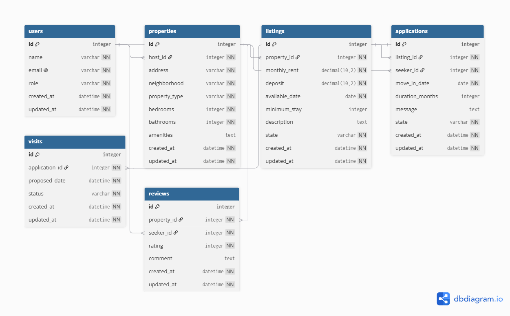

# Domain Model

```dbml
Table users {
  id integer [pk, increment]
  name varchar [not null]
  email varchar [not null, unique]
  role varchar [not null, default: 'member']
  created_at datetime [not null]
  updated_at datetime [not null]
}

Table properties {
  id integer [pk, increment]
  host_id integer [not null]
  address varchar [not null]
  neighborhood varchar [not null]
  property_type varchar [not null]
  bedrooms integer [not null]
  bathrooms integer [not null]
  amenities text
  created_at datetime [not null]
  updated_at datetime [not null]
}

Table listings {
  id integer [pk, increment]
  property_id integer [not null]
  monthly_rent decimal(10,2) [not null]
  deposit decimal(10,2) [not null]
  available_date date [not null]
  minimum_stay integer
  description text
  state varchar [not null, default: 'draft']
  created_at datetime [not null]
  updated_at datetime [not null]
}

Table applications {
  id integer [pk, increment]
  listing_id integer [not null]
  seeker_id integer [not null]
  move_in_date date [not null]
  duration_months integer
  message text
  state varchar [not null, default: 'pending']
  created_at datetime [not null]
  updated_at datetime [not null]
}

Table visits {
  id integer [pk, increment]
  application_id integer [not null]
  proposed_date datetime [not null]
  status varchar [not null, default: 'scheduled']
  created_at datetime [not null]
  updated_at datetime [not null]
}

Table reviews {
  id integer [pk, increment]
  property_id integer [not null]
  seeker_id integer [not null]
  rating integer [not null]
  comment text
  created_at datetime [not null]
  updated_at datetime [not null]
}

Ref: properties.host_id > users.id
Ref: listings.property_id > properties.id
Ref: applications.listing_id > listings.id
Ref: applications.seeker_id > users.id
Ref: visits.application_id > applications.id
Ref: reviews.property_id > properties.id
Ref: reviews.seeker_id > users.id

